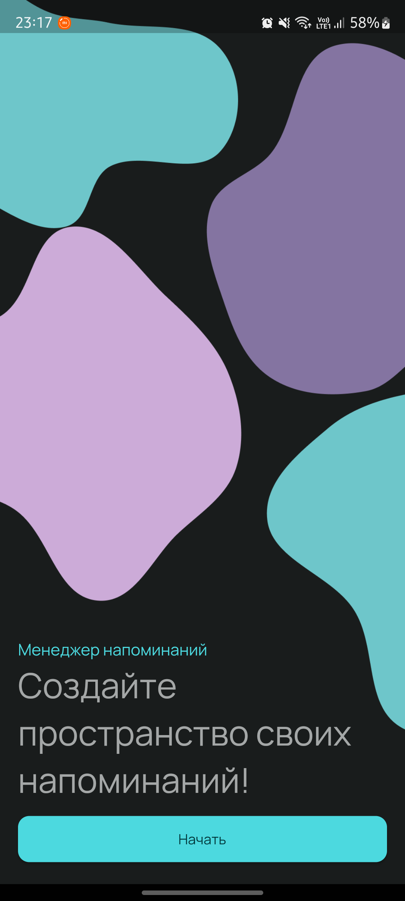
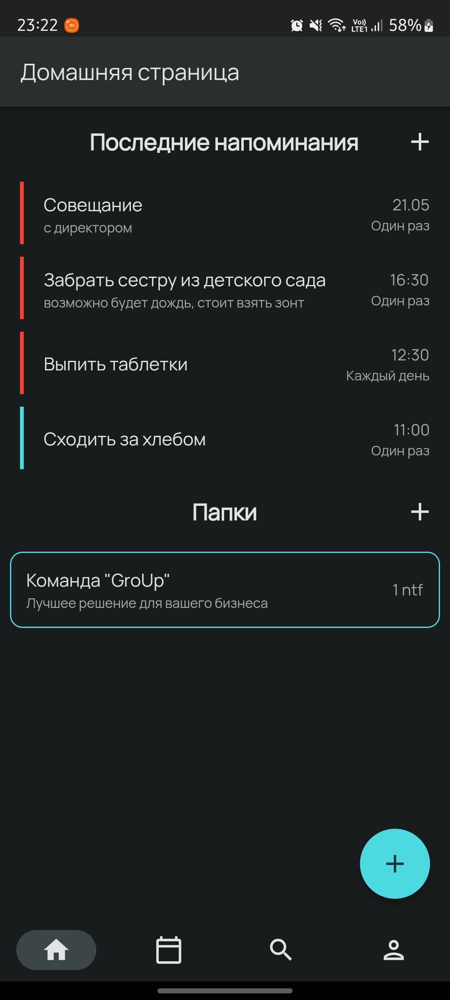
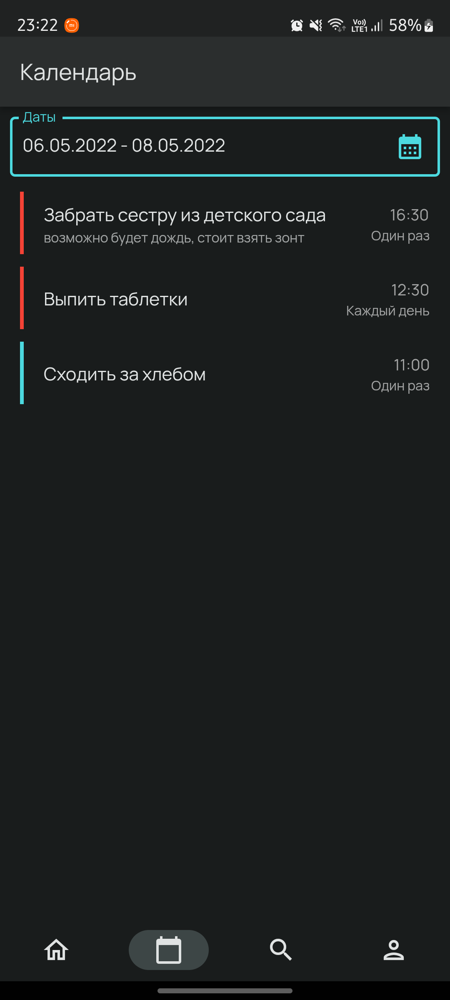
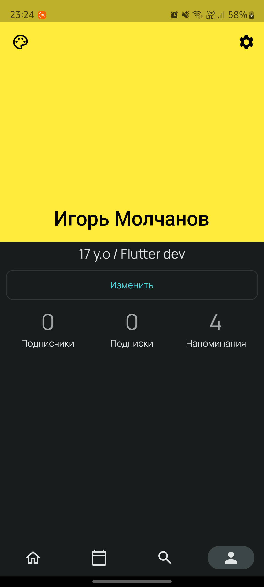
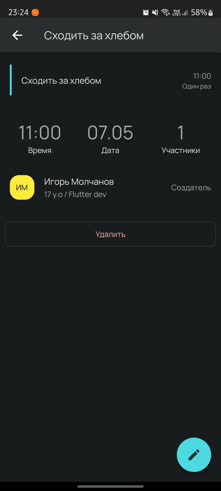

# Notify
An application for creating and working reminders in a team! 

## Screenshots

  
  
  
  
  

## Assets

The `assets` directory houses images, fonts, and any other files you want to
include with your application.

The `assets/images` directory contains [resolution-aware
images](https://flutter.dev/docs/development/ui/assets-and-images#resolution-aware).

## Localization

This project generates localized messages based on arb files found in
the `lib/src/localization` directory.

To support additional languages, please visit the tutorial on
[Internationalizing Flutter
apps](https://flutter.dev/docs/development/accessibility-and-localization/internationalization)

## Server open source
https://github.com/meg4cyberc4t/NotifyServer
